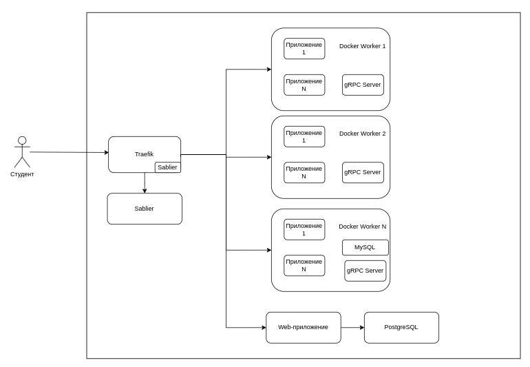

# Thesis - Serverless Hosting для студентов колледжа

Система serverless хостинга для образовательных учреждений, позволяющая студентам развертывать и тестировать веб-приложения в изолированной среде с автоматическим развертыванием и управлением ресурсами.

## 📋 Описание проекта

Данная система предназначена для создания современной образовательной инфраструктуры, которая позволяет студентам:

- Развертывать веб-приложения без настройки серверной инфраструктуры
- Работать в команде над совместными проектами
- Изучать современные технологии контейнеризации и микросервисов

### 🎯 Основные возможности

- **Масштабирование по требованию** с возможностью установки лимитов ресурсов
- **Мультитенантность** с изоляцией проектов между пользователями
- **Веб-интерфейс** для управления проектами и мониторинга
- **Образы на основе Docker Images** можно задеплоить дюбой проект
- **Система квот** для контроля использования ресурсов

## 🏗️ Архитектура системы



### Основные компоненты

- **FullStack**: Flet с FastAPI приложение для пользовательского интерфейса
- **API Gateway**: Traefik с настроенной маршрутизацией и балансировкой нагрузки
- **Agent**: Python gRPC
- **Container Runtime**: Docker для изоляции приложений
- **Orchestrator**: Docker Swarm для управления контейнерами
- **Database**: PostgreSQL для хранения метаданных

## 🚀 Быстрый старт

### Требования к системе

- **Операционная система**: Ubuntu 20.04+ или CentOS 8+
- **RAM**: минимум 8GB, рекомендуется 16GB+
- **CPU**: минимум 4 ядра, рекомендуется 8+
- **Дисковое пространство**: минимум 100GB SSD
- **Сеть**: статический IP-адрес в локальной сети

### Предварительная требования

1. **Установите Docker**

### Установка системы

1. **Клонирование репозитория**:

```bash
git clone https://github.com/mainStorne/Thesis.git
cd Thesis
```

2. **Выберите конфигурация для деплоя**:

Существует две конфигурации:

- Подходящая для [одного хоста](./docker-compose.prod.one-host.yaml)
- Подходящая для [нескольких](./docker-compose.prod.yaml)

3. **Запустите**

```bash
docker service create --name registry --publish published=5000,target=5000 registry:2
docker compose -f ваш_yaml build agent web
docker compose -f ваш_yaml push agent web
docker stack deploy -c ваш_yaml thesis
```

## 💻 Использование

### Для студентов

1. **Регистрация в системе**:
   - Откройте веб-интерфейс по адресу `http://localhost`
   - Войдите в свой аккаунт по логину и паролю

2. **Развертывание приложения**:
   - В веб-интерфейсе нажмите "Создать проект"
   - Выберите zip архив
   - Выберите тип приложения
   - Нажмите "Загрузить"

### Для преподавателей

1. **Просмотр проектов студентов**:
   - Создайте группу для своего курса
   - Добавьте студентов в группу
   - Администрируйте и просматривайте проекты студентов

2.  **Создание образов проекта**:
    - В веб-интерфейсе нажмине "Создать образ"
    - Выберите Dockerfile для образа
    - Вставьте содержимое Dockerfile образа
    - Создайте образ

### 🔧 Конфигурация (web|agent/settings.yml)

Создайте в каждом сервисе конфигурационный файл по примеру settings.example.yml

```bash

cp settings.example.yml settings.yml
```

```yaml
quota:
  students_shared_base_dir: /students
  students_home_base_dir: /home
database:
  db: serverless_hosting
  user: admin
  password: secure_password
  host: db
  port: 5432

swarm:
  overlay_network_name: thesis_default

domain: thesis.com
mysql:
  password: vFaWi722cKdlA8PeXuyAYoEYzEI
  host: 127.0.0.1

jwt_secret: secret
```

### Переменные окружения

Создайте файл `.env` с необходимыми переменными:

```bash
# База данных
POSTGRES_HOST=localhost
POSTGRES_PORT=5432
POSTGRES_DB=serverless_hosting
POSTGRES_USER=admin
POSTGRES_PASSWORD=secure_password
```

**Внимание** переменные которые вы поставите для базы данные необходимо продублировать в settings.yml для сервиса web

### По умолчанию создается аккаунт администратора

login: admin
password: admin

### Как внести свой вклад?

  - Создайте [docker registry](./create-registry.sh)
  ```bash
  sh create-registry.sh
  ```
  - Создайте overlay network
  ```bash
  docker network create --attachable -d overlay thesis_default
  ```
  - Запустите [docker stack](./docker-compose.dev.yaml)
  ```bash
  docker stack deploy -c docker-compose.dev.yaml thesis
  ```
  - Запустите [devcontainer](./.devcontainer/devcontainer.json), который создает среду разработки
